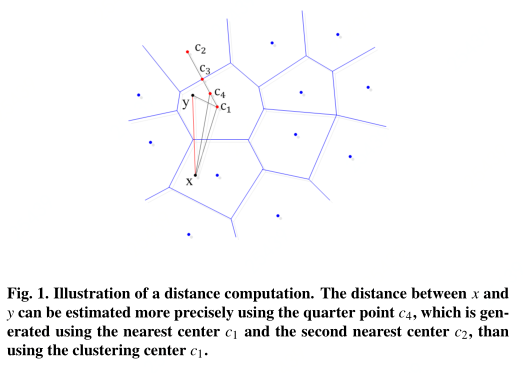
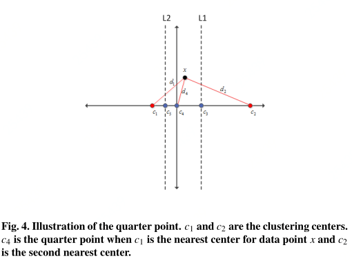
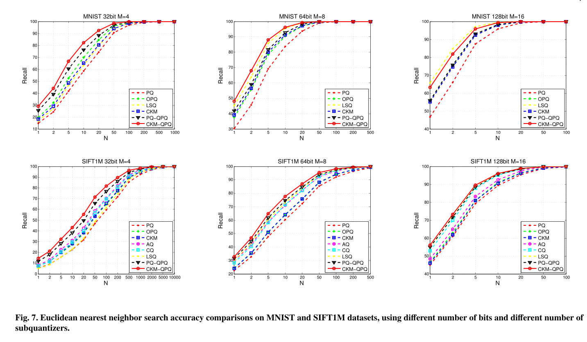
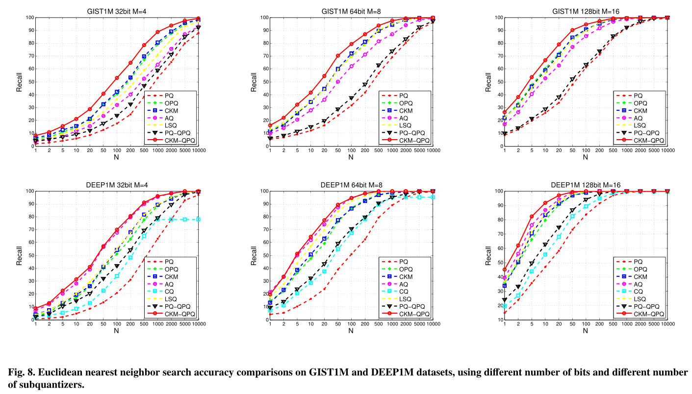

# QuarterPointPQ
Quarter-point Product Quantization for Approximate Nearest Neighbor Search
This is the Matlab implementation of our Pattern Recognition Letters paper:
**Shan An**, Zhibiao Huang, Shuang Bai, Guangfu Che, Xin Ma, Jie Luo* and Yu Chen. Quarter-point Product Quantization for Approximate Nearest Neighbor Search. Pattern Recognition Letters，Volume 125, 1 July 2019, Pages 187-194. 

Abstract:
Vector quantization can be used to achieve high accuracy for fast approximate nearest neighbor (ANN) search. Most existing vector quantization methods use codeword expansion to enhance the representative capacity of codebooks learned by clustering methods, which may decrease the quantization distortion and increase the accuracy. In this paper, we propose a novel codeword expansion method named Quarter-point Product Quantization (QPQ) to further minimize quantization distortions, by estimating the distances from the query points to the database points using the quarter points instead of the clustering centers. The distances can be computed more precisely and it will result in a lower distortion using QPQ, which is also a general method could be used to improve all PQ-based methods. Extensive experiments on several approximate nearest neighbor datasets show that our QPQ method can significantly improve the accuracy of PQ-based methods and consistently outperform other state-of-the-art methods.

## License
The project is licensed under the New BSD license. It makes use of several third-party libraries:
